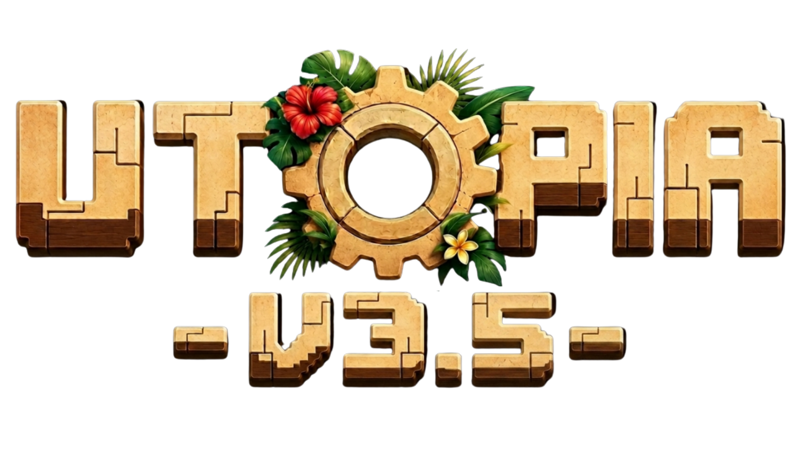

<p align="center"></p>

<h1 align="center">Utopia Launcher</h1>

<p align="center">Rejoins le serveur <strong>Utopia</strong> sans te soucier d'installer Java, NeoForge ou les mods. On s'occupe de tout pour toi.</p>

<p align="center">
  <a href="https://discord.gg/QGcZWFQBgU"></a>
</p>

---

## 🌴 Bienvenue sur Utopia 3.5

> Utopia 3.5 est un serveur Minecraft **semi-RP** pensé avant tout pour créer une aventure communautaire unique. Ici, le RP est encouragé — parce qu'il permet de créer des situations drôles, des histoires mémorables et des interactions entre joueurs — mais il n'est **jamais obligatoire**. Vous pouvez vous investir pleinement dans votre personnage ou simplement profiter du serveur à votre manière.

### 🏝️ Une île, une communauté

Cette nouvelle saison prend place sur une **immense île tropicale** où tous les joueurs sont réunis. L'objectif est simple : favoriser les rencontres, les échanges, les rivalités commerciales et les projets personnels. Personne ne peut partir s'isoler à des milliers de blocs ; tout le monde partage le même espace de vie, ce qui rend le monde beaucoup plus **vivant et dynamique**.

### ⚙️ Un modpack pensé pour l'interaction

Le modpack s'inspire de l'esprit d'**Holycube Révolution** et de **Crazy Town**, en mélangeant progression, économie, automatisation, commerce, événements et vie communautaire. **Create** occupe une place centrale dans l'expérience, mais le serveur ne repose pas uniquement sur ce mod. Tout a été pensé pour encourager les interactions entre joueurs, le développement d'activités économiques et la création de moments marquants.

### 💰 Une économie au cœur du jeu

L'économie est l'un des piliers majeurs du serveur. Grâce à la monnaie officielle, les **Utopièces**, chacun peut développer son activité, vendre ses productions, proposer ses services et tenter de devenir l'un des joueurs les plus riches de l'île. Les commerces, les échanges et les opportunités seront au cœur de la progression.

Pour préserver l'île et maintenir cette proximité entre les joueurs, les **ressources principales devront être récupérées en dehors de celle-ci**. Au-delà des océans qui entourent le territoire principal se trouve une zone dédiée à l'exploration et à la récolte de ressources — l'île reste avant tout un lieu de vie, de commerce et de rencontres.

### 🎉 Des événements réguliers

Utopia 3.5 dispose d'un **serveur dédié aux événements**. Plusieurs fois par semaine, des animations seront organisées par l'équipe événementielle, avec à la clé des récompenses, des Utopièces et parfois même des cadeaux spéciaux. Ces événements constitueront des moments importants de la vie du serveur et offriront régulièrement de nouvelles occasions de se démarquer.

### 📖 Écris ton histoire

L'objectif final n'est pas seulement de construire une base ou d'automatiser des usines : c'est de faire vivre **une ville, une économie et une communauté**. De créer des souvenirs, des histoires et des moments dont on se souviendra encore plusieurs mois après la fin de la saison.

Enfin, plusieurs **créateurs de contenu** participeront à l'aventure. Gardez donc à l'esprit que de nombreux moments seront enregistrés ou diffusés : le respect des autres joueurs et une bonne ambiance seront essentiels pour que chacun profite pleinement de l'expérience.

**Bienvenue sur Utopia 3.5. À vous maintenant d'écrire l'histoire de l'île.** 🌅

---

## ✨ Fonctionnalités

* 🔒 **Gestion complète des comptes.**
  * Ajoute plusieurs comptes et passe de l'un à l'autre en un clic.
  * Connexion **Microsoft (OAuth 2.0)** entièrement prise en charge.
  * Tes identifiants ne sont jamais stockés.
* 📂 **Gestion automatique du modpack.**
  * Reçois les mises à jour du serveur dès leur sortie.
  * Les fichiers sont vérifiés avant le lancement : tout fichier corrompu ou manquant est re-téléchargé.
* ☕ **Validation automatique de Java.**
  * Pas la bonne version de Java ? On installe la bonne *pour toi*.
  * Tu n'as même pas besoin d'avoir Java installé.
* 🧩 **NeoForge géré automatiquement** — le bon NeoForge et toutes ses bibliothèques sont installés sans rien faire.
* 🌗 **Thème jour / nuit** — le fond du launcher s'adapte selon l'heure.
* 📰 Fil d'actualités intégré au launcher.
* ⚙️ Réglages intuitifs, dont un panneau de contrôle Java (RAM, etc.).
* 🔄 **Mises à jour automatiques** — le launcher se met à jour tout seul.

---

## 📥 Téléchargement

Récupère la dernière version depuis les [GitHub Releases](https://github.com/Oracios/UtopiaLauncher/releases).

| Plateforme | Fichier |
| ---------- | ------- |
| Windows x64 | `Utopia-Launcher-setup-VERSION.exe` |
| Linux x64   | `Utopia-Launcher-setup-VERSION.AppImage` |

> [!NOTE]
> Le serveur Utopia tourne en **Minecraft 1.21.1 — NeoForge**.

---

## 🖥️ Console

Pour ouvrir la console (en cas de problème) :

```console
ctrl + shift + i
```

Assure-toi que l'onglet **Console** est sélectionné. Ne colle **jamais** quoi que ce soit dans la console si tu n'es pas sûr à 100 % de ce que ça fait — ça peut exposer des informations sensibles.

---

## 🛠️ Développement

### Prérequis

* [Node.js](https://nodejs.org/en/) **v22**

### Installation

```console
git clone https://github.com/Oracios/UtopiaLauncher.git
cd UtopiaLauncher
npm install
```

### Lancer en mode dev

```console
npm start
```

### Construire l'installeur

| Plateforme  | Commande             |
| ----------- | -------------------- |
| Windows x64 | `npm run dist:win`   |
| Linux x64   | `npm run dist:linux` |
| Plateforme courante | `npm run dist` |

> 📖 La génération du `distribution.json` (modpack NeoForge) est documentée dans [tools/README-UTOPIA.md](tools/README-UTOPIA.md).

---

## 💬 Communauté

Le meilleur moyen de nous contacter, c'est sur Discord :

<p align="center"><a href="https://discord.gg/QGcZWFQBgU"></a></p>

---

## 🙏 Crédits

Utopia Launcher est basé sur [Helios Launcher](https://github.com/dscalzi/HeliosLauncher) de **Daniel Scalzi**, sous licence MIT. Un grand merci à lui et à la communauté Helios.

<p align="center">À bientôt en jeu. 🌍</p>
